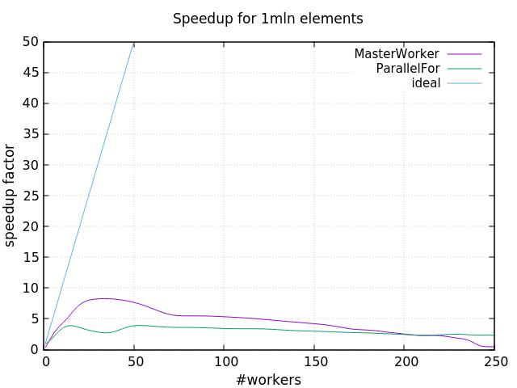
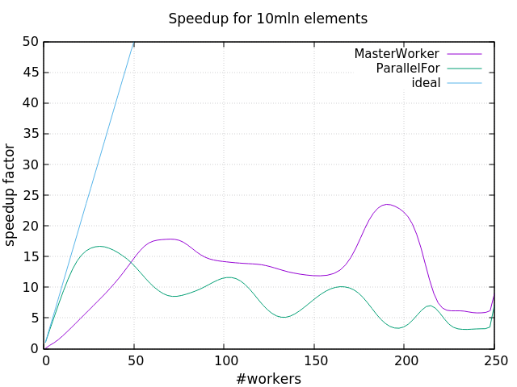
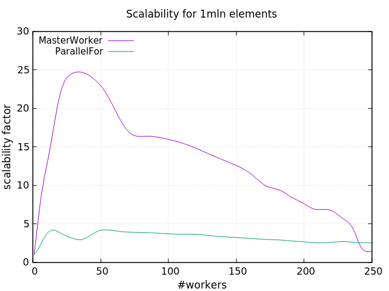
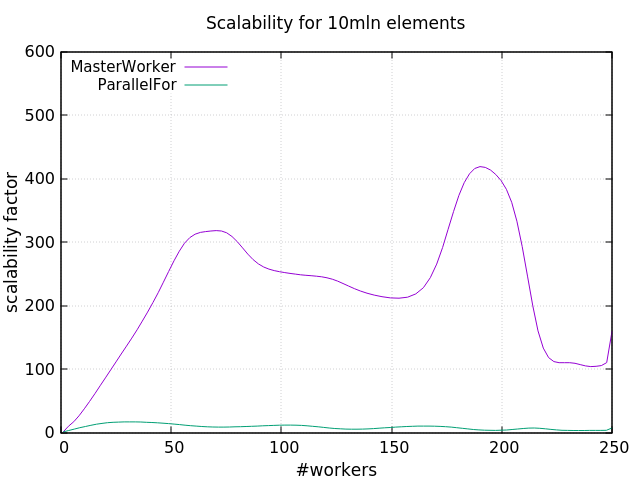

# Finding primes

This is the second assignment for the class of [Parallel and Distributed Systems](http://didawiki.di.unipi.it/doku.php/magistraleinformaticanetworking/spm/sdpm09support) @Unipi.  
I developed two implementations for the problem of finding prime numbers among a given range, using different patterns provided by the [FastFlow library](http://calvados.di.unipi.it/).  
  

## Getting Started

To build the project simply clone the repo and build it using the cmake file provided.


### Building
To generate the build system do:  
```
mkdir -p build
cd build
cmake ..
```
in the root of the cloned project.  
Now build the project:
```
cmake --build .
```


### Running
The executable can be found in the ```build/``` directory. Just run it with:

```./build/finding_primes``` 


## Results
The experience results are summarized in some plots that express the scalability and the speedup obtained running the code on the Xeon-phi machine.  
The benchmarks depict two situations:
* finding primes in the range 1~1mln and
* finding primes in the range 1~10mln.  

For each scenario I computed the execution time considering 1 up to 250 threads. Following are illustrated the plots with the metrics described. 










## Authors

**Davide Barasti** in collaboration with my roommates [Giovanni](https://github.com/GiovanniSorice) and [Francesco](https://github.com/FraCorti)